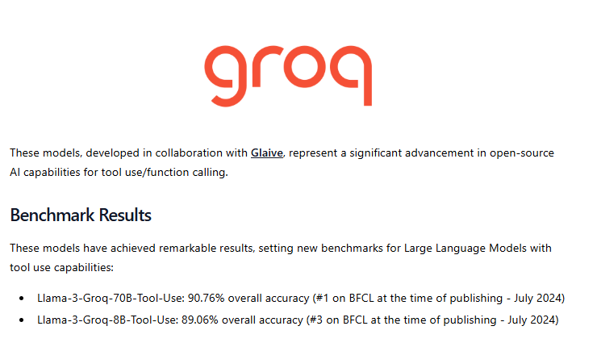
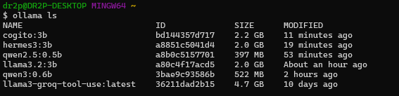

# ToolsService

## Visão Geral
O `ToolsService` é um serviço projetado para lidar com a comunicação entre modelos de linguagens 
LLM e servidores de ferramentas [MCP](https://modelcontextprotocol.io/). Ele utiliza conexões
STDIO ou SSE para ter acesso além das ferramentas, a prompts e aos recursos.
A ideia principal é que posso ser possível segregar o modelo de LLM que chama a ferramenta
do modelo que irá responder o usuário final. Isso se deve pelo fato de que muitos modelos 
disponíveis atualmente não são treinados para ter uma alta taxa de conversão das chamadas de 
ferramentas, respondendo então da sua base de treinamento ao invés de invocar a ferramenta 
quando ela estiver disponível, tome como exemplo o modelo abaixo:



Repare que ele foi treinado para converter 89% das chamadas que deveriam acionar as tools 
disponíveis quando as descrições da ferramenta e dos parâmetros são suficientes, no entanto,
nem todos os modelos são assim, incluindo os mais populares.
Nos testes presentes nesse repositório esse modelo `llama3-groq-8B-Tool-Use` identifica as 
chamadas no padrão configurado de 5 tentativas (mesmo nos servidores contendo descrições 
pífias do que fazem). Pegando pelo repositório de modelos disponíveis no 
[Ollama](https://ollama.com/search?c=tools) outros modelos testados foram:



Lembrando que se tratando de um serviço que apenas deve **fazer a chamada da tool** não faria
sentido usar modelos muito maiores. Os testes foram feitos em uma `Nvidia RTX 3090` e os 
parâmetros de retry recomendados foram:

|   modelo   | retry | size  | vRAM ocupada | Ordem Custo/Benefício |
|:----------:|:-----:|:-----:|:------------:|:---------------------:|
| cogito:3b  |   5   | 2.2GB | 3.4GB | 4 |
| hermes3:3b |  50   | 2.0GB | 3.4GB | 5 |
|  qwen2.5:0.5b |  15   | 398MB |  1.0GB | 2 |
| llama3.2:3b |  10   | 2.0GB | 3.4GB | 6 |
| qwen3:0.6b |   8   | 523MB | 1.8GB | 3 |
| llama3-groq-tool-use:latest |   5   | 4.7GB |  5.8GB | 1 |

O produto principal é o `Prompt` nele estará a `ToolCall` que é o objetivo desse serviço caso 
a chamada de fato exista. Ao final espera-se que esse `Prompt` seja utilizado em uma LLM para 
virar um `ChatCompletion`. Todas essas entidades são provenientes da **CLI da OpenAI**, que no 
momento não existe a necessidade de abstrair por ser um padrão aceito por vários provedores 
de LLM. 

## Recursos Principais
- Integração com servidores diversos via diferentes transportes (`Stdio`, `SSE`).
- Configuração dinâmica de conexões entre servidores de ferramentas e LLMs.
- Validação de parâmetros de ferramentas antes de executá-las.
- Suporte à execução de prompts configurados para o ambiente de ferramentas.
- Carregamento e consulta de recursos e prompts do servidor.

---

## Exemplo de Uso - `Main.kt`

Abaixo segue um exemplo funcional mostrando como inicializar o `ToolsService` e utilizar seus métodos principais para chamar ferramentas ou consultar prompts e recursos.

```kotlin
val severURL = "http://localhost:8080"
val httpClient = HttpClient() { 
    install(SSE) 
    install(Logging) 
}

val transport = Transport.Sse(
    url = severURL, 
    client = httpClient
)

// Configurando a conexão com o servidor de Tool
val toolsConnection = ToolsServerConnection(transport)

val llmConnection = LLMHostConnection(
    nameOrKey = "ollama",
    hostPath = "http://localhost:11434/v1/", 
    modelName = "llama3-groq-tool-use"
)

// Iniciando o serviço 
val service = ToolsService(
    llmConnection, 
    toolsConnection,
    retry = 5
)

val prompt = PromptBuilder()
    .appendSystemMessage("You ALWAYS search for tools to get the results.")
    .appendUserMessage("Add 2 to 3 using available tools.")  // PromptBuilder é um wraper do Prompt
val updatedPrompt = service.updateWithToolCall(prompt)       // Recebe novamente o Prompt

// Fim do escopo do serviço
// A seguir é o ciclo esperado de como o resultado deva ser utilizado.

val response = llmConnection.query(updatedPrompt, false).choices.first().message.content as String
assert(response.contains("5"))
```

Para servidores protegidos por autenticação por HTTP Headers configure no *HttpClient* o seguinte:
```kotlin
val httpClient = HttpClient() {
            install(SSE)
            install(Logging)
                defaultRequest {
                    headers.append("Authorization", "Bearer ...") 
                }
        }
```
---
## Estrutura do Projeto

### Arquivos principais
1. **`ToolsService.kt`**: O núcleo do serviço, gerencia conexões com servidores e interações com ferramentas.
2. **`LLMHostConnection.kt`**: Gerencia a conexão com o LLM e realiza consultas.
3. **`PromptBuilder.kt`**: Cria e organiza mensagens baseadas no estado dos prompts.
4. **`ToolsServerConnection.kt`**: Abstração para conexão com servidores de ferramentas e seus recursos.

### Testes de integração
Os testes fornecidos em `ToolsServiceTest` cobrem:
- Configuração de ferramentas com múltiplos transportes (Stdio & SSE).
- Chamadas de ferramentas em servidores.
- Validação de parâmetros e respostas.
- Consulta de prompts e recursos disponíveis.

Execute os testes para entender melhor os comportamentos esperados e validar a implementação antes do uso em produção.

---

Sinta-se à vontade para contribuir ou ampliar as funcionalidades conforme necessário!
